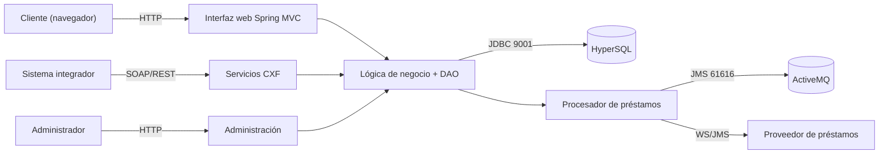
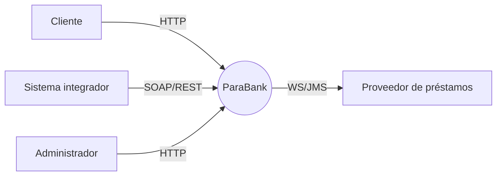
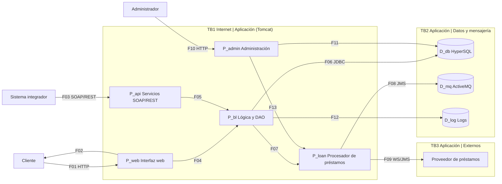
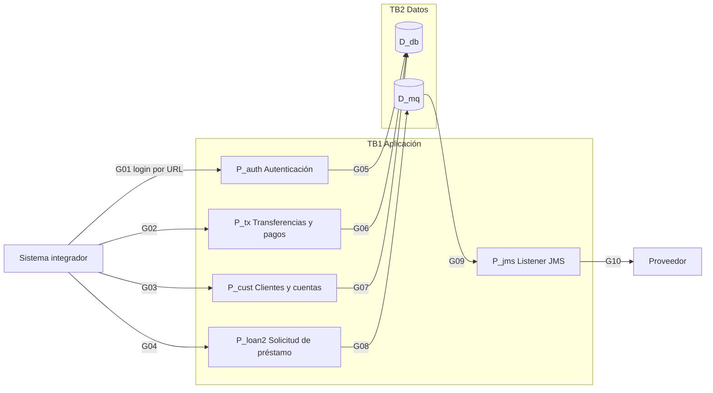
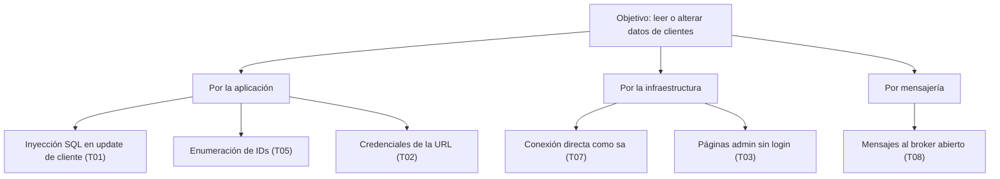

# Modelo de Amenazas de ParaBank con OWASP Threat Dragon

**Universidad Mariano Gálvez de Guatemala** · Maestría en Seguridad Informática · Seguridad en Aplicaciones  
**Tarea 2 (individual)** · Fecha: 5 de octubre de 2026  
**Autor:** [Nombre y carnet]

> Borrador de trabajo. Está pensado para que lo revises, lo valides contra la herramienta y lo reescribas con tus propias palabras antes de entregarlo.

---

## 1. Resumen ejecutivo

Se modeló ParaBank, la aplicación bancaria de demostración de Parasoft (web + servicios SOAP/REST), con DFD de niveles 0, 1 y 2 y análisis STRIDE. Se identificaron **23 amenazas**: **5 críticas, 8 altas, 9 medias y 1 baja**. Las críticas se concentran en tres áreas: la inyección SQL en la actualización de clientes, la exposición de credenciales en la URL de login y la ausencia de control de acceso en las operaciones administrativas y de mantenimiento.

ParaBank es una aplicación **deliberadamente vulnerable** para pruebas. Los hallazgos se presentan como si fuera un banco real para practicar el método, no como críticas a un producto productivo.

## 2. Alcance, fuentes y supuestos

**Sistema evaluado:** ParaBank (Parasoft), módulos de banca en línea: autenticación, cuentas, transferencias, pago de facturas, préstamos, administración, API SOAP/REST, base de datos y mensajería. El módulo auxiliar *Bookstore* queda fuera de alcance porque no forma parte del flujo bancario.

**Fuente de la arquitectura:** código público https://github.com/parasoft/parabank, commit `13cc8d4c`, y su README. Los sitios de documentación de Parasoft no estaban accesibles desde el entorno de trabajo, por lo que todo se apoya en el código.

**Criterio de evidencia.** Cada amenaza indica si es *confirmada en código* o una *hipótesis a validar*. Una hipótesis es un riesgo plausible que no pudo comprobarse leyendo el código (por ejemplo, el control de propiedad de recursos en la API).

**Supuestos de despliegue:** Tomcat con la configuración por defecto del README (HTTP, sin TLS terminado en la aplicación), HyperSQL en TCP 9001 y ActiveMQ en TCP 61616. Si el despliegue real usa TLS o segmentación de red, la probabilidad de varias amenazas baja.

**Validación pendiente con Arquitectura y Desarrollo.** La actividad pide validar las amenazas con esos equipos. Aquí solo se contrastó con el código fuente; las hipótesis deben confirmarse con pruebas autorizadas en un entorno propio.

## 3. Levantamiento de arquitectura

### 3.1 Arquitectura lógica

### 3.2 Inventario de componentes

| ID | Tipo | Componente | Función | Tecnología / archivo |
|---|---|---|---|---|
| P_web | Proceso | Interfaz web (Spring MVC + JSP) | Páginas *.htm; usa LoginInterceptor para las páginas protegidas. | DispatcherServlet, parabank-servlet.xml |
| P_api | Proceso | Servicios SOAP/REST (Apache CXF) | Endpoints /services/* (JAX-WS y JAX-RS) y /services_proxy/*. | CXFServlet, cxf.xml, ParaBankService |
| P_bl | Proceso | Lógica de negocio y DAO | BankManager, AdminManager y capa DAO JDBC. | domain.logic, dao.jdbc |
| P_loan | Proceso | Procesador de préstamos | LoanProcessor con umbral configurable y listener JMS. | AbstractLoanProcessor, JmsLoanProcessor |
| P_admin | Proceso | Administración y utilidades | admin.htm, db.htm, initializeDB.htm, jms.htm y operaciones de mantenimiento. | AdminController, JmsListenerController |
| D_db | Almacén | Base de datos HyperSQL | Tablas Customer, Account, Transaction, Positions, Parameter, News. | jdbc:hsqldb:hsql://localhost/parabank (9001) |
| D_mq | Almacén | Broker ActiveMQ | Colas de solicitud y respuesta de préstamos. | applicationContext-jms.xml (61616) |
| D_log | Almacén | Bitácoras (log4j2) | Registros de la aplicación. | log4j2.xml |
| E_cli | Entidad externa | Cliente (navegador web) | Usuario final que opera su banca en línea desde un navegador. | Navegador |
| E_adm | Entidad externa | Administrador / operador | Persona que configura la demo: parámetros, base de datos, JMS. | Navegador |
| E_int | Entidad externa | Sistema integrador (cliente API) | Aplicación externa que consume los servicios SOAP/REST. | HTTP SOAP/REST |
| E_prov | Entidad externa | Proveedor externo de préstamos | Sistema que aprueba o rechaza solicitudes de préstamo (WS/JMS). | ConfigurableLoanProvider |

### 3.3 Inventario de activos de información

| Activo | Ubicación | Clasificación | Justificación |
|---|---|---|---|
| Credenciales (usuario y contraseña) | Tabla Customer, formularios, ruta de login | Crítico | Permiten tomar cuentas bancarias |
| SSN y datos personales del cliente | Tabla Customer | Crítico | Habilitan suplantación de identidad |
| Saldos, cuentas y transacciones | Tablas Account y Transaction | Crítico | Integridad financiera |
| Sesión del cliente (JSESSIONID) | Cookie del navegador | Alto | Su robo equivale a suplantar al cliente |
| Parámetros de configuración (umbral de préstamos, modo de acceso) | Tabla Parameter | Alto | Alteran reglas de negocio |
| Solicitudes y respuestas de préstamo | Colas ActiveMQ | Alto | Decisiones crediticias |
| Bitácoras de la aplicación | log4j2 | Medio | Evidencia de auditoría |
| Noticias y contenido público | Tabla News | Bajo | Información pública |

### 3.4 Clasificación de flujos por criticidad

| Flujo | Origen → Destino | Contenido | Protocolo | Cruza frontera | Criticidad |
|---|---|---|---|---|---|
| F01 | Cliente (navegador web) → Interfaz web (Spring MVC + JSP) | Credenciales y operaciones bancarias | HTTP | TB1 | Crítico |
| F02 | Interfaz web (Spring MVC + JSP) → Cliente (navegador web) | Páginas y cookie de sesión | HTTP | TB1 | Alto |
| F03 | Sistema integrador (cliente API) → Servicios SOAP/REST (Apache CXF) | Peticiones SOAP/REST (login en URL, transferencias) | HTTP | TB1 | Crítico |
| F04 | Interfaz web (Spring MVC + JSP) → Lógica de negocio y DAO | Invocación interna | In-process | - | Medio |
| F05 | Servicios SOAP/REST (Apache CXF) → Lógica de negocio y DAO | Invocación interna | In-process | - | Medio |
| F06 | Lógica de negocio y DAO → Base de datos HyperSQL | Consultas y actualizaciones JDBC | JDBC/TCP 9001 | TB2 | Crítico |
| F07 | Lógica de negocio y DAO → Procesador de préstamos | Solicitud de préstamo | In-process | - | Medio |
| F08 | Procesador de préstamos → Broker ActiveMQ | Mensajes JMS de solicitud y respuesta | JMS/TCP 61616 | TB2 | Alto |
| F09 | Procesador de préstamos → Proveedor externo de préstamos | Consulta de aprobación al proveedor | WS/JMS | TB3 | Alto |
| F10 | Administrador / operador → Administración y utilidades | Parámetros, initializeDB, cleanDB, JMS | HTTP | TB1 | Crítico |
| F11 | Administración y utilidades → Base de datos HyperSQL | Reinicio de datos y parámetros | JDBC/TCP 9001 | TB2 | Crítico |
| F12 | Lógica de negocio y DAO → Bitácoras (log4j2) | Eventos de la aplicación | Archivo | - | Medio |
| F13 | Administración y utilidades → Procesador de préstamos | Arranque/parada del listener y umbral | In-process | - | Alto |

**Arquitectura lógica validada:** contrastada con `cxf.xml`, `web.xml`, `parabank-servlet.xml`, `applicationContext-jms.xml` y `jdbc.properties`.

## 4. Diagramas de flujo de datos (Threat Dragon)

Los diagramas se modelaron en OWASP Threat Dragon. Los esquemas Mermaid de esta sección son una vista de apoyo; **las capturas oficiales deben tomarse de Threat Dragon**, importando `02-Threat-Dragon/parabank-threat-model.json`.

### 4.1 Nivel 0: contexto

Entidades externas: cliente, administrador, sistema integrador y proveedor de préstamos. Un único proceso representa el sistema. La frontera TB1 separa Internet de la aplicación y TB3 separa la aplicación del proveedor externo.

### 4.2 Nivel 1: procesos, almacenes y fronteras

**Propiedades de los flujos** (relevantes para el motor de reglas, como advierte la guía de la clase):

| Flujo | Protocolo | Provides Confidentiality | Provides Integrity | Red pública |
|---|---|---|---|---|
| F01 | HTTP | No | No | Sí |
| F02 | HTTP | No | No | Sí |
| F03 | HTTP | No | No | Sí |
| F04 | In-process | Sí | Sí | No |
| F05 | In-process | Sí | Sí | No |
| F06 | JDBC/TCP 9001 | No | No | No |
| F07 | In-process | Sí | Sí | No |
| F08 | JMS/TCP 61616 | No | No | No |
| F09 | WS/JMS | No | No | Sí |
| F10 | HTTP | No | No | Sí |
| F11 | JDBC/TCP 9001 | No | No | No |
| F12 | Archivo | Sí | Sí | No |
| F13 | In-process | Sí | Sí | No |

Los flujos internos *in-process* se marcan con confidencialidad e integridad en Sí porque no salen de la JVM. Los que usan HTTP, JDBC o JMS sobre TCP en el despliegue por defecto se marcan en No. Esto es deliberado: reflejan la realidad del despliegue y evitan falsos negativos.

**Trust boundaries**

| Frontera | Separa | Flujos que la cruzan | Motivo |
|---|---|---|---|
| TB1 | Internet y redes no confiables / Aplicación en Tomcat | F01, F02, F03, F10 | Es donde entra todo dato no confiable |
| TB2 | Aplicación / Base de datos y broker | F06, F08, F11 | Los datos de mayor valor viven al otro lado |
| TB3 | Aplicación / Proveedores externos de préstamos | F09 | Tercero fuera del control del equipo |

### 4.3 Nivel 2: API de servicios y procesador de préstamos

Descompone el servicio API y el circuito de préstamos, que es la integración con sistemas de terceros y middleware. Cada proceso se modela por separado de la BD para no confundir las reglas de STRIDE entre procesos y almacenes.

## 5. Análisis de amenazas con STRIDE

Se revisó cada flujo, proceso y almacén. Las amenazas se identificaron manualmente aplicando STRIDE a cada elemento y apoyándose en el código fuente; **no** provienen del motor automático de Threat Dragon. Conviene ejecutar además la generación automática de la herramienta, comparar ambas listas y anotar las diferencias. Se identificaron 23 amenazas.

### 5.1 Matriz STRIDE consolidada

| Elemento | S | T | R | I | D | E | Total |
|---|---|---|---|---|---|---|---|
| Gestión de clientes y cuentas |  | 1 |  |  |  |  | 1 |
| Autenticación y sesión | 1 |  |  | 1 |  |  | 2 |
| Administración y utilidades |  |  | 1 |  |  | 1 | 2 |
| Servicios SOAP/REST (Apache CXF) |  |  |  | 2 | 1 | 2 | 5 |
| Base de datos HyperSQL | 1 |  |  | 1 |  |  | 2 |
| Broker ActiveMQ |  | 1 |  |  |  |  | 1 |
| Flujo F01: Credenciales y operaciones bancarias |  |  |  | 1 |  |  | 1 |
| Interfaz web (Spring MVC + JSP) | 1 | 1 |  |  |  |  | 2 |
| Transferencias, depósitos y pago de facturas |  | 1 |  |  |  |  | 1 |
| Procesador de préstamos |  | 1 |  |  |  |  | 1 |
| Lógica de negocio y DAO |  |  | 1 |  |  | 1 | 2 |
| Bitácoras (log4j2) |  | 1 |  |  |  |  | 1 |
| Listener JMS de préstamos |  |  |  |  | 1 |  | 1 |
| Flujo F09: Consulta de aprobación al proveedor | 1 |  |  |  |  |  | 1 |
| **Total** | 4 | 6 | 2 | 5 | 2 | 4 | 23 |

S = Spoofing, T = Tampering, R = Repudiation, I = Information Disclosure, D = Denial of Service, E = Elevation of Privilege.

### 5.2 Inventario de amenazas

| ID | Amenaza | STRIDE | Elemento | Evidencia |
|---|---|---|---|---|
| T01 | Inyección SQL en la actualización de clientes | Tampering | Gestión de clientes y cuentas | Confirmado en código (JdbcCustomerDao.updateCustomer; el propio comentario indica que el fallo es intencional). Existe SecureJdbcCustomerDao con parámetros. |
| T02 | Credenciales viajan en la URL (GET /login/{usuario}/{contraseña}) | Information Disclosure | Autenticación y sesión | Confirmado en código (@Path("/login/{username}/{password}") en ParaBankService). |
| T03 | Páginas de administración fuera del control de sesión | Elevation of Privilege | Administración y utilidades | Confirmado en parabank-servlet.xml (secureHandlerMapping). A validar: que no exista otro filtro o regla de red. |
| T04 | Endpoints de mantenimiento expuestos en la API (cleanDB, initializeDB, setParameter, shutdownJmsListener) | Elevation of Privilege | Servicios SOAP/REST (Apache CXF) | Confirmado la exposición de rutas en ParaBankService. A validar: ausencia de control de acceso en la implementación. |
| T05 | Acceso a cuentas y clientes ajenos mediante identificadores (BOLA/IDOR) | Information Disclosure | Servicios SOAP/REST (Apache CXF) | Hipótesis a validar con pruebas autorizadas: la interfaz no muestra control de propiedad del recurso. |
| T06 | Contraseñas y SSN almacenados sin protección criptográfica | Information Disclosure | Base de datos HyperSQL | Confirmado en código (JdbcCustomerDao: BASE_QUERY_SQL y consulta de login). |
| T07 | Cuenta sa sin contraseña y puerto HyperSQL 9001 accesible | Spoofing | Base de datos HyperSQL | Confirmado en jdbc.properties y README (puerto 9001). |
| T08 | Broker ActiveMQ en 0.0.0.0:61616 sin autenticación configurada | Tampering | Broker ActiveMQ | Confirmado en applicationContext-jms.xml (transportConnector tcp://0.0.0.0:61616; sin plugin de seguridad en ese bloque). |
| T09 | Tráfico HTTP sin TLS: credenciales y cookie de sesión interceptables | Information Disclosure | Flujo F01: Credenciales y operaciones bancarias | Supuesto de despliegue por defecto; depende de la instalación. |
| T10 | CSRF sobre transferencias y pagos | Tampering | Interfaz web (Spring MVC + JSP) | Hipótesis: búsqueda de 'csrf' sin resultados en el código fuente analizado. |
| T11 | Manipulación de monto o cuenta en operaciones monetarias | Tampering | Transferencias, depósitos y pago de facturas | Hipótesis a validar: depende de las validaciones de la implementación del servicio. |
| T12 | Fuerza bruta y credential stuffing sobre el login | Spoofing | Autenticación y sesión | Hipótesis: no se identificó rate limiting ni bloqueo en el código revisado. |
| T13 | Alteración del umbral de aprobación de préstamos y del modo de acceso | Tampering | Procesador de préstamos | Confirmado el uso del parámetro en AbstractLoanProcessor; la explotación depende de T03 y T04. |
| T14 | Cabeceras CORS abiertas a cualquier origen | Information Disclosure | Servicios SOAP/REST (Apache CXF) | Confirmado en código (ParaBankService). |
| T15 | Falta de no repudio en transacciones | Repudiation | Lógica de negocio y DAO | Hipótesis: no se hallaron firmas ni confirmación fuerte de operaciones. |
| T16 | Acciones administrativas sin identidad ni auditoría | Repudiation | Administración y utilidades | Consecuencia de T03; a validar. |
| T17 | Bitácoras modificables y con datos sensibles | Tampering | Bitácoras (log4j2) | Hipótesis: configuración de log4j2 por defecto. |
| T18 | Denegación de servicio por API sin límites | Denial of Service | Servicios SOAP/REST (Apache CXF) | Hipótesis: no se identificó limitación de tasa. |
| T19 | Inundación de solicitudes de préstamo sobre la cola JMS | Denial of Service | Listener JMS de préstamos | Confirmado en applicationContext-jms.xml (concurrentConsumers=5; persistent=false). |
| T20 | Suplantación del proveedor de préstamos o respuesta falsa | Spoofing | Flujo F09: Consulta de aprobación al proveedor | Hipótesis: depende de la configuración del proveedor. |
| T21 | Procesamiento XML inseguro en servicios SOAP (XXE) | Elevation of Privilege | Servicios SOAP/REST (Apache CXF) | Hipótesis a validar con revisión de la configuración del parser. |
| T22 | Dependencias de terceros sin gestión de vulnerabilidades | Elevation of Privilege | Lógica de negocio y DAO | Riesgo general de cadena de suministro; verificable con SCA sobre pom.xml. |
| T23 | Cookie de sesión sin atributos de endurecimiento verificados | Spoofing | Interfaz web (Spring MVC + JSP) | Hipótesis a validar en web.xml y en la configuración de Tomcat. |

### 5.3 Descripción técnica

**T01 · Inyección SQL en la actualización de clientes** (Tampering). El DAO arma el UPDATE concatenando customer.getFirstName() dentro de la sentencia; el dato cruza TB1 por POST /customers/update/{id} y llega sin parametrizar al motor HyperSQL (F06/G07). Un atacante puede cerrar la cadena e inyectar SQL que altere o exponga filas de Customer.

**T02 · Credenciales viajan en la URL (GET /login/{usuario}/{contraseña})** (Information Disclosure). El servicio REST recibe usuario y contraseña como segmentos de la ruta. Al cruzar TB1 quedan en el historial del navegador, en logs de Tomcat, proxies y cabeceras Referer, aun si el canal fuera cifrado.

**T03 · Páginas de administración fuera del control de sesión** (Elevation of Privilege). El mapeo protegido por LoginInterceptor solo cubre nueve páginas de cliente; admin.htm, db.htm, initializeDB.htm y jms.htm no figuran, por lo que cualquiera que llegue a Tomcat podría cambiar parámetros, reiniciar la BD o detener el listener JMS (F10, F11, F13).

**T04 · Endpoints de mantenimiento expuestos en la API (cleanDB, initializeDB, setParameter, shutdownJmsListener)** (Elevation of Privilege). La interfaz de servicio publica operaciones destructivas y de configuración sin mecanismo de autenticación visible en la propia interfaz. Un cliente API externo que cruza TB1 puede borrar datos, reinicializar la BD o apagar la mensajería (F03, F05).

**T05 · Acceso a cuentas y clientes ajenos mediante identificadores (BOLA/IDOR)** (Information Disclosure). Rutas como /accounts/{accountId}, /customers/{customerId} y /transactions/{id} reciben identificadores secuenciales; la interfaz no muestra verificación de que el recurso pertenezca al llamante. Un atacante autenticado o anónimo puede enumerar identificadores y leer datos personales y financieros (F03, F05).

**T06 · Contraseñas y SSN almacenados sin protección criptográfica** (Information Disclosure). La tabla Customer guarda password y ssn y el login compara el valor directamente en SQL (username = ? AND password = ?), lo que implica almacenamiento en texto claro. Una lectura de la BD (por ejemplo vía T01 o por el puerto 9001) expone credenciales y datos de identidad (F06).

**T07 · Cuenta sa sin contraseña y puerto HyperSQL 9001 accesible** (Spoofing). jdbc.properties define jdbc.username=sa con contraseña vacía y el servidor HyperSQL escucha por TCP (9001). Cualquier host con alcance de red puede conectarse como administrador de la BD y saltar toda la lógica de la aplicación (F06, F11).

**T08 · Broker ActiveMQ en 0.0.0.0:61616 sin autenticación configurada** (Tampering). El broker se publica en todas las interfaces y la configuración no declara plugin de autenticación ni autorización. Un tercero puede inyectar o leer mensajes de solicitud y respuesta de préstamos que cruzan TB2 (F08).

**T09 · Tráfico HTTP sin TLS: credenciales y cookie de sesión interceptables** (Information Disclosure). El despliegue por defecto en Tomcat usa HTTP. Los flujos F01, F02, F03 y F10 cruzan la frontera de Internet con Provides Confidentiality = No e Integrity = No, de modo que un atacante en la ruta puede leer credenciales y cookie JSESSIONID o modificar montos.

**T10 · CSRF sobre transferencias y pagos** (Tampering). No se encontraron referencias a token anti-CSRF en el código. Una página maliciosa puede hacer que el navegador de la víctima, con sesión activa, envíe un POST a transfer.htm o billpay.htm sin su consentimiento (F01).

**T11 · Manipulación de monto o cuenta en operaciones monetarias** (Tampering). Monto, cuenta origen y destino llegan como parámetros del cliente a /transfer, /deposit, /withdraw y /billpay (G02). Sin validación de negocio en el servidor ni integridad del canal, un atacante puede modificar el monto o ejecutar operaciones en nombre de otro.

**T12 · Fuerza bruta y credential stuffing sobre el login** (Spoofing). No se observa limitación de intentos ni bloqueo de cuenta; el login por ruta facilita el scripting masivo (G01, G05). Un atacante con listas de credenciales filtradas puede suplantar clientes legítimos.

**T13 · Alteración del umbral de aprobación de préstamos y del modo de acceso** (Tampering). loanProcessorThreshold y accessmode se leen de la tabla Parameter y pueden modificarse con setParameter o admin.htm. Combinado con las amenazas de acceso administrativo, un atacante puede forzar aprobaciones fraudulentas de préstamos (F13).

**T14 · Cabeceras CORS abiertas a cualquier origen** (Information Disclosure). ParaBankService está anotado con @CrossOriginResourceSharing(allowAllOrigins = true). Cualquier sitio web puede invocar la API desde el navegador de un usuario autenticado y leer la respuesta (F03).

**T15 · Falta de no repudio en transacciones** (Repudiation). Las transacciones no llevan firma ni sello de tiempo verificable del cliente; si este niega una operación, el banco solo cuenta con su propio registro (F04, F12).

**T16 · Acciones administrativas sin identidad ni auditoría** (Repudiation). Como el módulo administrativo no exige autenticación, los cambios de parámetros, reinicios de BD y paradas de JMS no pueden atribuirse a una persona (F10, F11, F13).

**T17 · Bitácoras modificables y con datos sensibles** (Tampering). Los logs de log4j2 se escriben en archivo local sin protección de integridad; un atacante con acceso al host puede borrar rastros, y los registros pueden contener identificadores de clientes (F12).

**T18 · Denegación de servicio por API sin límites** (Denial of Service). Sin rate limiting ni cuotas, un cliente puede saturar Tomcat o la BD con peticiones masivas (F03, F05, F06).

**T19 · Inundación de solicitudes de préstamo sobre la cola JMS** (Denial of Service). El listener usa 5 consumidores concurrentes y el broker no es persistente; una avalancha de solicitudes puede saturar la cola o perder mensajes legítimos (G08, G09).

**T20 · Suplantación del proveedor de préstamos o respuesta falsa** (Spoofing). La respuesta del proveedor cruza TB3 por WS/JMS; sin autenticación mutua ni firma, un tercero puede responder aprobaciones falsas.

**T21 · Procesamiento XML inseguro en servicios SOAP (XXE)** (Elevation of Privilege). Los endpoints SOAP procesan XML con JAXB/CXF; si el parser permite entidades externas, un mensaje manipulado puede leer archivos del servidor o provocar SSRF (F03).

**T22 · Dependencias de terceros sin gestión de vulnerabilidades** (Elevation of Privilege). La aplicación depende de Spring, CXF, WSS4J, ActiveMQ y Tomcat. Una vulnerabilidad conocida en cualquiera permite ejecución remota o escalamiento sin tocar el código propio.

**T23 · Cookie de sesión sin atributos de endurecimiento verificados** (Spoofing). No se verificó que JSESSIONID use Secure, HttpOnly y SameSite ni que exista timeout por inactividad; una sesión robada permite suplantar al cliente (F02).

### 5.4 Registro de validación técnica

| Verificación | Resultado |
|---|---|
| Rutas protegidas por LoginInterceptor | Solo nueve páginas de cliente en `secureHandlerMapping`; no incluye admin, db, initializeDB ni jms (T03) |
| Acceso a datos | El UPDATE de Customer concatena `firstName` (T01); el resto de DAOs usa parámetros |
| Credenciales de BD | `jdbc.username=sa`, contraseña vacía (T07) |
| Broker de mensajería | `tcp://0.0.0.0:61616`, sin plugin de seguridad en ese bloque (T08) |
| CORS | `@CrossOriginResourceSharing(allowAllOrigins = true)` (T14) |
| Token anti-CSRF | Búsqueda de `csrf` sin resultados (T10) |
| Validación con Arquitectura y Desarrollo | **Pendiente.** Las hipótesis requieren pruebas autorizadas |

## 6. Priorización de riesgos

**Escala.** Impacto: Crítico (4), Alto (3), Medio (2), Bajo (1). Probabilidad: Muy Alta (4), Alta (3), Media (2), Baja (1). El puntaje es impacto × probabilidad. Nivel: **Crítico ≥ 9**, **Alto 6–8**, **Medio 3–5**, **Bajo ≤ 2**. Esta regla reproduce la tabla del enunciado (Alto/Alto = Crítico, Alto/Medio = Alto, Medio/Medio = Medio, Bajo/Bajo = Bajo).

### 6.1 Matriz de riesgos (impacto × probabilidad)

| Impacto \ Probabilidad | Muy Alta | Alta | Media | Baja |
|---|---|---|---|---|
| **Crítico** | Crítico | Crítico · T03, T04 | Alto · T06, T07 | Medio |
| **Alto** | Crítico · T01 | Crítico · T02, T05 | Alto · T08, T09, T10, T11, T12, T13 | Medio · T20, T21, T22 |
| **Medio** | Alto | Alto | Medio · T14, T15, T16, T18, T19, T23 | Bajo · T17 |
| **Bajo** | Medio | Medio | Bajo | Bajo |

### 6.2 Ranking de amenazas

| # | ID | Amenaza | Impacto | Probabilidad | Puntaje | Nivel |
|---|---|---|---|---|---|---|
| 1 | T01 | Inyección SQL en la actualización de clientes | Alto | Muy Alta | 12 | Crítico |
| 2 | T03 | Páginas de administración fuera del control de sesión | Crítico | Alta | 12 | Crítico |
| 3 | T04 | Endpoints de mantenimiento expuestos en la API (cleanDB, initializeDB, setParameter, shutdownJmsListener) | Crítico | Alta | 12 | Crítico |
| 4 | T02 | Credenciales viajan en la URL (GET /login/{usuario}/{contraseña}) | Alto | Alta | 9 | Crítico |
| 5 | T05 | Acceso a cuentas y clientes ajenos mediante identificadores (BOLA/IDOR) | Alto | Alta | 9 | Crítico |
| 6 | T06 | Contraseñas y SSN almacenados sin protección criptográfica | Crítico | Media | 8 | Alto |
| 7 | T07 | Cuenta sa sin contraseña y puerto HyperSQL 9001 accesible | Crítico | Media | 8 | Alto |
| 8 | T08 | Broker ActiveMQ en 0.0.0.0:61616 sin autenticación configurada | Alto | Media | 6 | Alto |
| 9 | T09 | Tráfico HTTP sin TLS: credenciales y cookie de sesión interceptables | Alto | Media | 6 | Alto |
| 10 | T10 | CSRF sobre transferencias y pagos | Alto | Media | 6 | Alto |
| 11 | T11 | Manipulación de monto o cuenta en operaciones monetarias | Alto | Media | 6 | Alto |
| 12 | T12 | Fuerza bruta y credential stuffing sobre el login | Alto | Media | 6 | Alto |
| 13 | T13 | Alteración del umbral de aprobación de préstamos y del modo de acceso | Alto | Media | 6 | Alto |
| 14 | T14 | Cabeceras CORS abiertas a cualquier origen | Medio | Media | 4 | Medio |
| 15 | T15 | Falta de no repudio en transacciones | Medio | Media | 4 | Medio |
| 16 | T16 | Acciones administrativas sin identidad ni auditoría | Medio | Media | 4 | Medio |
| 17 | T18 | Denegación de servicio por API sin límites | Medio | Media | 4 | Medio |
| 18 | T19 | Inundación de solicitudes de préstamo sobre la cola JMS | Medio | Media | 4 | Medio |
| 19 | T23 | Cookie de sesión sin atributos de endurecimiento verificados | Medio | Media | 4 | Medio |
| 20 | T20 | Suplantación del proveedor de préstamos o respuesta falsa | Alto | Baja | 3 | Medio |
| 21 | T21 | Procesamiento XML inseguro en servicios SOAP (XXE) | Alto | Baja | 3 | Medio |
| 22 | T22 | Dependencias de terceros sin gestión de vulnerabilidades | Alto | Baja | 3 | Medio |
| 23 | T17 | Bitácoras modificables y con datos sensibles | Medio | Baja | 2 | Bajo |

### 6.3 Top 10 de hallazgos prioritarios

| # | ID | Hallazgo | Nivel | Evidencia |
|---|---|---|---|---|
| 1 | T01 | Inyección SQL en la actualización de clientes | Crítico | Confirmado en código (JdbcCustomerDao |
| 2 | T03 | Páginas de administración fuera del control de sesión | Crítico | Confirmado en parabank-servlet |
| 3 | T04 | Endpoints de mantenimiento expuestos en la API (cleanDB, initializeDB, setParameter, shutdownJmsListener) | Crítico | Confirmado la exposición de rutas en ParaBankService |
| 4 | T02 | Credenciales viajan en la URL (GET /login/{usuario}/{contraseña}) | Crítico | Confirmado en código (@Path("/login/{username}/{password}") en ParaBankService) |
| 5 | T05 | Acceso a cuentas y clientes ajenos mediante identificadores (BOLA/IDOR) | Crítico | Hipótesis a validar con pruebas autorizadas: la interfaz no muestra control de propiedad del recurso |
| 6 | T06 | Contraseñas y SSN almacenados sin protección criptográfica | Alto | Confirmado en código (JdbcCustomerDao: BASE_QUERY_SQL y consulta de login) |
| 7 | T07 | Cuenta sa sin contraseña y puerto HyperSQL 9001 accesible | Alto | Confirmado en jdbc |
| 8 | T08 | Broker ActiveMQ en 0.0.0.0:61616 sin autenticación configurada | Alto | Confirmado en applicationContext-jms |
| 9 | T09 | Tráfico HTTP sin TLS: credenciales y cookie de sesión interceptables | Alto | Supuesto de despliegue por defecto; depende de la instalación |
| 10 | T10 | CSRF sobre transferencias y pagos | Alto | Hipótesis: búsqueda de 'csrf' sin resultados en el código fuente analizado |

### 6.4 Tratamiento del riesgo

Siguiendo las estrategias vistas en clase: **mitigar** las críticas y altas (todas lo requieren), **transferir** parte del riesgo de DoS contratando protección anti-DDoS o un servicio gestionado, **aceptar** formalmente las de nivel Bajo (T17) con revisión periódica y **evitar** publicar las operaciones de mantenimiento en producción.

## 7. Catálogo de casos de abuso (amenazas críticas y altas)

### T01 · Inyección SQL en la actualización de clientes

*Tampering · Riesgo Crítico*

| Campo | Descripción |
|---|---|
| Actor | Atacante externo con acceso a la API |
| Objetivo del atacante | Leer o modificar datos de todos los clientes |
| Vector de ataque | POST /customers/update/{id} con firstName malicioso |
| Precondiciones | Alcance de red al servicio y un ID de cliente válido |
| Método de explotación | Cerrar la cadena con una comilla y concatenar sentencias o subconsultas sobre la tabla Customer |
| Impacto esperado | Pérdida de integridad y confidencialidad de la base de clientes |
| Control preventivo | Consultas parametrizadas, validación de entrada, BD con mínimo privilegio |
| Control detectivo | WAF y SIEM con reglas de inyección, alerta de errores SQL |
| Acción correctiva | Revocar credenciales, restaurar desde respaldo, corregir el DAO y notificar el incidente |

### T02 · Credenciales viajan en la URL (GET /login/{usuario}/{contraseña})

*Information Disclosure · Riesgo Crítico*

| Campo | Descripción |
|---|---|
| Actor | Atacante en la red o con acceso a logs |
| Objetivo del atacante | Obtener credenciales de clientes |
| Vector de ataque | Lectura de logs de Tomcat, proxies o historial con la URL de login |
| Precondiciones | Acceso a logs o al tráfico |
| Método de explotación | Extraer usuario y contraseña de la ruta /login/{usuario}/{contraseña} |
| Impacto esperado | Toma de cuentas bancarias |
| Control preventivo | Login por POST con token y TLS |
| Control detectivo | DLP sobre logs, alerta de accesos desde ubicaciones nuevas |
| Acción correctiva | Forzar cambio de contraseñas expuestas y depurar logs |

### T03 · Páginas de administración fuera del control de sesión

*Elevation of Privilege · Riesgo Crítico*

| Campo | Descripción |
|---|---|
| Actor | Atacante externo anónimo |
| Objetivo del atacante | Tomar control administrativo de la aplicación |
| Vector de ataque | Navegar a /parabank/admin.htm, db.htm o jms.htm |
| Precondiciones | Alcance HTTP al servidor |
| Método de explotación | Cambiar parámetros, reinicializar la BD o apagar el listener JMS desde las páginas administrativas |
| Impacto esperado | Pérdida de datos, fraude por parámetros alterados y caída del servicio |
| Control preventivo | Rol ADMIN con MFA y acceso solo desde red de gestión |
| Control detectivo | Alerta por acceso a rutas administrativas |
| Acción correctiva | Restaurar parámetros y BD, rotar credenciales y cerrar la exposición |

### T04 · Endpoints de mantenimiento expuestos en la API (cleanDB, initializeDB, setParameter, shutdownJmsListener)

*Elevation of Privilege · Riesgo Crítico*

| Campo | Descripción |
|---|---|
| Actor | Cliente API malicioso |
| Objetivo del atacante | Destruir datos o dejar fuera de servicio el sistema |
| Vector de ataque | POST /services/bank/cleanDB, /initializeDB, /shutdownJmsListener |
| Precondiciones | Alcance a /services |
| Método de explotación | Invocar directamente las operaciones de mantenimiento |
| Impacto esperado | Pérdida total de datos y disponibilidad |
| Control preventivo | Retirar o proteger con OAuth 2.0 y scope administrativo |
| Control detectivo | Registro y alerta de invocaciones de mantenimiento |
| Acción correctiva | Restauración desde respaldo y revisión del gateway |

### T05 · Acceso a cuentas y clientes ajenos mediante identificadores (BOLA/IDOR)

*Information Disclosure · Riesgo Crítico*

| Campo | Descripción |
|---|---|
| Actor | Cliente autenticado malicioso o anónimo |
| Objetivo del atacante | Leer datos financieros y personales ajenos |
| Vector de ataque | GET /accounts/{id} y /customers/{id} con IDs secuenciales |
| Precondiciones | Conocer o adivinar el formato del ID |
| Método de explotación | Enumeración de identificadores |
| Impacto esperado | Exposición de PII y saldos de múltiples clientes |
| Control preventivo | Autorización a nivel de objeto e IDs no predecibles |
| Control detectivo | Alerta por barridos secuenciales de IDs |
| Acción correctiva | Invalidar sesiones, notificar y corregir las comprobaciones |

### T06 · Contraseñas y SSN almacenados sin protección criptográfica

*Information Disclosure · Riesgo Alto*

| Campo | Descripción |
|---|---|
| Actor | Atacante con acceso a datos |
| Objetivo del atacante | Usar credenciales y SSN en claro |
| Vector de ataque | Lectura de la tabla Customer (inyección SQL o acceso directo a la BD) |
| Precondiciones | Cualquier acceso de lectura a la BD |
| Método de explotación | SELECT de usernames, passwords y SSN |
| Impacto esperado | Robo masivo de identidades y reutilización de contraseñas |
| Control preventivo | Hash Argon2id y cifrado de SSN |
| Control detectivo | Alerta por consultas masivas sobre Customer |
| Acción correctiva | Rotación forzada de credenciales y notificación a clientes |

### T07 · Cuenta sa sin contraseña y puerto HyperSQL 9001 accesible

*Spoofing · Riesgo Alto*

| Campo | Descripción |
|---|---|
| Actor | Atacante con alcance de red a la BD |
| Objetivo del atacante | Controlar la base de datos |
| Vector de ataque | Conexión JDBC/TCP al puerto 9001 como sa sin contraseña |
| Precondiciones | Alcance de red al puerto |
| Método de explotación | Conectar con un cliente JDBC y ejecutar SQL libre |
| Impacto esperado | Lectura, modificación y destrucción total de datos |
| Control preventivo | Cuenta de servicio de mínimo privilegio, bóveda de secretos y segmentación |
| Control detectivo | Logging de conexiones y alertas por orígenes nuevos |
| Acción correctiva | Rotar credenciales y reconstruir desde respaldo |

### T08 · Broker ActiveMQ en 0.0.0.0:61616 sin autenticación configurada

*Tampering · Riesgo Alto*

| Campo | Descripción |
|---|---|
| Actor | Atacante con alcance de red al broker |
| Objetivo del atacante | Falsificar o leer solicitudes de préstamo |
| Vector de ataque | Conexión a tcp://host:61616 |
| Precondiciones | Alcance al puerto del broker |
| Método de explotación | Publicar mensajes de respuesta con aprobación o consumir solicitudes |
| Impacto esperado | Préstamos fraudulentos y fuga de datos |
| Control preventivo | Autenticación, ACL, TLS y enlace a red interna |
| Control detectivo | Alertas de conexiones y mensajes anómalos |
| Acción correctiva | Purgar colas, rotar credenciales y revisar préstamos aprobados |

### T09 · Tráfico HTTP sin TLS: credenciales y cookie de sesión interceptables

*Information Disclosure · Riesgo Alto*

| Campo | Descripción |
|---|---|
| Actor | Atacante en la ruta de red (MITM) |
| Objetivo del atacante | Capturar credenciales y sesiones |
| Vector de ataque | Intercepción del tráfico HTTP del cliente |
| Precondiciones | Posición de red intermedia (Wi-Fi público, proxy) |
| Método de explotación | Sniffing de F01/F02 para obtener contraseña o JSESSIONID |
| Impacto esperado | Suplantación y fraude con la cuenta de la víctima |
| Control preventivo | TLS 1.2+, HSTS y cookies Secure |
| Control detectivo | Monitoreo de sesiones simultáneas |
| Acción correctiva | Invalidar sesiones y forzar cambio de contraseña |

### T10 · CSRF sobre transferencias y pagos

*Tampering · Riesgo Alto*

| Campo | Descripción |
|---|---|
| Actor | Atacante externo |
| Objetivo del atacante | Transferir fondos desde cuentas de víctimas |
| Vector de ataque | Página maliciosa que dispara POST a transfer.htm |
| Precondiciones | La víctima tiene sesión activa |
| Método de explotación | Formulario auto-enviado o petición cruzada de sitio |
| Impacto esperado | Transferencias no autorizadas |
| Control preventivo | Token CSRF, SameSite y OTP en operaciones de valor |
| Control detectivo | Reglas antifraude por monto y beneficiario nuevo |
| Acción correctiva | Reversar transferencias y reforzar controles |

### T11 · Manipulación de monto o cuenta en operaciones monetarias

*Tampering · Riesgo Alto*

| Campo | Descripción |
|---|---|
| Actor | Cliente malicioso |
| Objetivo del atacante | Alterar monto o cuenta de una operación |
| Vector de ataque | Modificar parámetros en POST /transfer o /billpay |
| Precondiciones | Sesión válida o acceso al API |
| Método de explotación | Cambiar amount o cuenta origen en la petición |
| Impacto esperado | Fraude financiero y descuadre contable |
| Control preventivo | Validación de negocio en servidor, firma e idempotencia |
| Control detectivo | Conciliación y reglas antifraude |
| Acción correctiva | Reversión y ajuste contable |

### T12 · Fuerza bruta y credential stuffing sobre el login

*Spoofing · Riesgo Alto*

| Campo | Descripción |
|---|---|
| Actor | Atacante con listas de credenciales filtradas |
| Objetivo del atacante | Tomar cuentas de clientes |
| Vector de ataque | Peticiones automatizadas a /login |
| Precondiciones | Listas de usuarios y contraseñas |
| Método de explotación | Credential stuffing sin límite de intentos |
| Impacto esperado | Fraude y daño reputacional |
| Control preventivo | MFA, bloqueo progresivo y rate limiting |
| Control detectivo | SIEM con alerta de fallos repetidos |
| Acción correctiva | Bloquear cuentas, forzar restablecimiento y notificar |

### T13 · Alteración del umbral de aprobación de préstamos y del modo de acceso

*Tampering · Riesgo Alto*

| Campo | Descripción |
|---|---|
| Actor | Atacante con acceso administrativo (por T03/T04) |
| Objetivo del atacante | Aprobar préstamos fraudulentos |
| Vector de ataque | Modificar loanProcessorThreshold vía setParameter o admin.htm |
| Precondiciones | Acceso a la administración |
| Método de explotación | Subir el umbral para que toda solicitud sea aprobada |
| Impacto esperado | Pérdidas por préstamos otorgados indebidamente |
| Control preventivo | Doble aprobación y rangos válidos |
| Control detectivo | Alerta de cambios de parámetros |
| Acción correctiva | Revertir parámetros y auditar préstamos aprobados |

### 7.1 Árbol de ataque: acceder a la base de datos de clientes

## 8. Controles de seguridad por amenaza

| ID | Amenaza | Controles (aplicación, API, infraestructura, monitoreo) |
|---|---|---|
| T01 | Inyección SQL en la actualización de clientes | **Aplicación:** Sentencias parametrizadas y uso de SecureJdbcCustomerDao en toda ruta de escritura **API:** Validación de esquema y longitud de campos en el endpoint **Infraestructura:** Cuenta de BD con privilegios mínimos distinta de sa **Monitoreo:** Alerta de WAF/SIEM por patrones de inyección |
| T02 | Credenciales viajan en la URL (GET /login/{usuario}/{contraseña}) | **API:** Autenticar con POST y cuerpo, o con OAuth 2.0/OIDC con tokens de corta vida **Infraestructura:** Excluir rutas sensibles del registro de acceso y de proxies **Monitoreo:** Detección de credenciales en logs (DLP) |
| T03 | Páginas de administración fuera del control de sesión | **Aplicación:** Autorización por rol (ADMIN) con deny-by-default en todas las rutas /admin **Infraestructura:** Publicar el módulo administrativo solo en red de gestión o VPN **Aplicación:** MFA para administradores **Monitoreo:** Alertas por acceso a rutas administrativas |
| T04 | Endpoints de mantenimiento expuestos en la API (cleanDB, initializeDB, setParameter, shutdownJmsListener) | **API:** Separar la API operativa de la administrativa y exigir token con scope admin en esta última **API:** API Gateway con listas de control de acceso por ruta **Infraestructura:** Segmentación de red: operaciones de mantenimiento solo desde red interna **Monitoreo:** Registro y alerta de invocaciones de mantenimiento |
| T05 | Acceso a cuentas y clientes ajenos mediante identificadores (BOLA/IDOR) | **API:** Autorización a nivel de objeto: comparar el ID del recurso con el sujeto del token **API:** Identificadores no predecibles (UUID) **Monitoreo:** Alerta por enumeración secuencial de IDs |
| T06 | Contraseñas y SSN almacenados sin protección criptográfica | **Aplicación:** Hash con Argon2id o bcrypt con sal por usuario **Infraestructura:** Cifrado de columnas sensibles (SSN) y gestión de claves en bóveda **Monitoreo:** Alertas por consultas masivas sobre Customer |
| T07 | Cuenta sa sin contraseña y puerto HyperSQL 9001 accesible | **Infraestructura:** Cuenta de aplicación con privilegios mínimos y contraseña robusta en bóveda de secretos **Infraestructura:** Segmentación: BD accesible solo desde el servidor de aplicaciones **Infraestructura:** Hardening: deshabilitar la cuenta sa por defecto **Monitoreo:** Logging de conexiones a la BD |
| T08 | Broker ActiveMQ en 0.0.0.0:61616 sin autenticación configurada | **Infraestructura:** Enlazar el broker a localhost o red interna y exigir TLS **Aplicación:** Autenticación y ACL por cola **Aplicación:** Firmar los mensajes de préstamo **Monitoreo:** Alertas de conexiones y mensajes anómalos |
| T09 | Tráfico HTTP sin TLS: credenciales y cookie de sesión interceptables | **Infraestructura:** TLS 1.2+ obligatorio con redirección y HSTS **Aplicación:** Cookie con Secure y HttpOnly **Monitoreo:** Monitoreo de certificados y de suites débiles |
| T10 | CSRF sobre transferencias y pagos | **Aplicación:** Token anti-CSRF por sesión en formularios de escritura **Aplicación:** Cookie SameSite=Lax/Strict **Aplicación:** Reautenticación o OTP para transferencias **Monitoreo:** Alerta de transferencias atípicas |
| T11 | Manipulación de monto o cuenta en operaciones monetarias | **API:** Validación de negocio en el servidor: propiedad de la cuenta, saldo y límites **API:** Firma o HMAC de la solicitud y control de idempotencia **Infraestructura:** TLS en tránsito **Monitoreo:** Reglas antifraude por monto y frecuencia |
| T12 | Fuerza bruta y credential stuffing sobre el login | **Aplicación:** MFA y bloqueo progresivo de cuenta **API:** Rate limiting por IP y por usuario en el API Gateway **Aplicación:** Política de contraseñas y verificación contra listas filtradas **Monitoreo:** SIEM con alerta de fallos de login repetidos |
| T13 | Alteración del umbral de aprobación de préstamos y del modo de acceso | **Aplicación:** Cambios de parámetros críticos con doble aprobación (cuatro ojos) **Aplicación:** Rangos válidos y límites máximos para el umbral **Monitoreo:** Alerta y auditoría de cambios de parámetros |
| T14 | Cabeceras CORS abiertas a cualquier origen | **API:** Lista blanca de orígenes permitidos **API:** No combinar CORS abierto con credenciales |
| T15 | Falta de no repudio en transacciones | **Aplicación:** Confirmación con OTP o firma para operaciones relevantes **Monitoreo:** Bitácora de auditoría con hash encadenado y sincronización de tiempo |
| T16 | Acciones administrativas sin identidad ni auditoría | **Aplicación:** Cuentas nominales con roles para administración **Monitoreo:** Log centralizado de acciones administrativas hacia el SIEM |
| T17 | Bitácoras modificables y con datos sensibles | **Monitoreo:** Envío en tiempo real a un SIEM con almacenamiento de solo anexado **Aplicación:** Enmascarar datos personales en logs |
| T18 | Denegación de servicio por API sin límites | **API:** Rate limiting y cuotas en el API Gateway **Infraestructura:** Protección anti-DDoS y autoescalado **Monitoreo:** Alertas de picos de tráfico |
| T19 | Inundación de solicitudes de préstamo sobre la cola JMS | **Aplicación:** Límite de solicitudes por cliente y tamaño de cola **Infraestructura:** Cola persistente y dead-letter queue **Monitoreo:** Alertas de profundidad de cola |
| T20 | Suplantación del proveedor de préstamos o respuesta falsa | **API:** TLS mutuo y firma de mensajes con validación de correlación **Monitoreo:** Conciliación de aprobaciones contra el proveedor |
| T21 | Procesamiento XML inseguro en servicios SOAP (XXE) | **API:** Deshabilitar DTD y entidades externas en el parser **API:** Validar contra XSD y limitar tamaño de mensaje **Infraestructura:** Egress filtering desde el servidor |
| T22 | Dependencias de terceros sin gestión de vulnerabilidades | **Aplicación:** SCA en el pipeline (OWASP Dependency-Check) y SBOM **Infraestructura:** Parcheo periódico de Tomcat y ActiveMQ |
| T23 | Cookie de sesión sin atributos de endurecimiento verificados | **Aplicación:** Cookie Secure/HttpOnly/SameSite, regeneración del ID al autenticar y timeout de 15 minutos **Monitoreo:** Detección de sesiones simultáneas desde orígenes distintos |

### 8.1 Riesgos residuales

Estimación tras aplicar los controles. Son valores a validar con el equipo y no una garantía.

| ID | Amenaza | Riesgo inicial | Riesgo residual |
|---|---|---|---|
| T01 | Inyección SQL en la actualización de clientes | Crítico | Bajo |
| T02 | Credenciales viajan en la URL (GET /login/{usuario}/{contraseña}) | Crítico | Bajo |
| T03 | Páginas de administración fuera del control de sesión | Crítico | Bajo |
| T04 | Endpoints de mantenimiento expuestos en la API (cleanDB, initializeDB, setParameter, shutdownJmsListener) | Crítico | Bajo |
| T05 | Acceso a cuentas y clientes ajenos mediante identificadores (BOLA/IDOR) | Crítico | Bajo |
| T06 | Contraseñas y SSN almacenados sin protección criptográfica | Alto | Bajo |
| T07 | Cuenta sa sin contraseña y puerto HyperSQL 9001 accesible | Alto | Medio |
| T08 | Broker ActiveMQ en 0.0.0.0:61616 sin autenticación configurada | Alto | Bajo |
| T09 | Tráfico HTTP sin TLS: credenciales y cookie de sesión interceptables | Alto | Bajo |
| T10 | CSRF sobre transferencias y pagos | Alto | Bajo |
| T11 | Manipulación de monto o cuenta en operaciones monetarias | Alto | Bajo |
| T12 | Fuerza bruta y credential stuffing sobre el login | Alto | Bajo |
| T13 | Alteración del umbral de aprobación de préstamos y del modo de acceso | Alto | Bajo |

## 9. Matriz de riesgos y remediación

| ID | Riesgo | Severidad | Responsable | Acción correctiva | Fecha objetivo |
|---|---|---|---|---|---|
| T01 | Inyección SQL en la actualización de clientes | Crítico | Desarrollo | Reemplazar la concatenación por parámetros con nombre y habilitar siempre SecureJdbcCustomerDao; agregar prueba unitaria de inyección. | 2026-11-05 |
| T03 | Páginas de administración fuera del control de sesión | Crítico | Arquitectura | Proteger las rutas administrativas con rol ADMIN y MFA, y separarlas del acceso público. | 2026-11-05 |
| T04 | Endpoints de mantenimiento expuestos en la API (cleanDB, initializeDB, setParameter, shutdownJmsListener) | Crítico | Arquitectura | Retirar de producción las operaciones de mantenimiento o protegerlas con OAuth 2.0 y scope administrativo detrás de un API Gateway. | 2026-11-05 |
| T02 | Credenciales viajan en la URL (GET /login/{usuario}/{contraseña}) | Crítico | Arquitectura | Retirar el login por GET y migrar a un flujo con token (OAuth 2.0/OIDC); depurar logs existentes. | 2026-11-05 |
| T05 | Acceso a cuentas y clientes ajenos mediante identificadores (BOLA/IDOR) | Crítico | Desarrollo | Implementar verificación de propiedad en cada operación por ID y pruebas automatizadas de BOLA. | 2026-11-05 |
| T06 | Contraseñas y SSN almacenados sin protección criptográfica | Alto | Desarrollo | Migrar contraseñas a hash Argon2id y cifrar o tokenizar el SSN. | 2027-04-05 |
| T07 | Cuenta sa sin contraseña y puerto HyperSQL 9001 accesible | Alto | Infraestructura | Crear cuenta de servicio con mínimos privilegios, retirar sa, cerrar el puerto a la red y mover secretos a bóveda. | 2027-01-05 |
| T08 | Broker ActiveMQ en 0.0.0.0:61616 sin autenticación configurada | Alto | Infraestructura | Restringir el listener a la red interna, habilitar autenticación, ACL y TLS en ActiveMQ. | 2027-01-05 |
| T09 | Tráfico HTTP sin TLS: credenciales y cookie de sesión interceptables | Alto | Infraestructura | Terminar TLS en un balanceador o en Tomcat, activar HSTS y marcar cookies Secure/HttpOnly. | 2027-01-05 |
| T10 | CSRF sobre transferencias y pagos | Alto | Desarrollo | Agregar token CSRF y SameSite en todos los formularios y exigir OTP para operaciones de alto valor. | 2027-04-05 |
| T11 | Manipulación de monto o cuenta en operaciones monetarias | Alto | Desarrollo | Validar propiedad, saldo y límites en servidor; agregar firma de solicitud e idempotencia. | 2027-04-05 |
| T12 | Fuerza bruta y credential stuffing sobre el login | Alto | Desarrollo | Implementar MFA, bloqueo progresivo y rate limiting en el gateway. | 2027-01-05 |
| T13 | Alteración del umbral de aprobación de préstamos y del modo de acceso | Alto | Arquitectura | Imponer doble aprobación, validación de rangos y auditoría de los parámetros críticos. | 2027-04-05 |
| T14 | Cabeceras CORS abiertas a cualquier origen | Medio | Desarrollo | Sustituir allowAllOrigins por una lista de orígenes autorizados. | 2027-01-05 |
| T15 | Falta de no repudio en transacciones | Medio | Desarrollo | Registrar evidencia de consentimiento (OTP, IP, dispositivo, hora) por cada transacción. | 2027-04-05 |
| T16 | Acciones administrativas sin identidad ni auditoría | Medio | Arquitectura | Registrar usuario, hora y valor anterior y nuevo en cada cambio administrativo. | 2027-04-05 |
| T18 | Denegación de servicio por API sin límites | Medio | Infraestructura | Poner un API Gateway con cuotas y protección anti-DDoS delante de los servicios. | 2027-04-05 |
| T19 | Inundación de solicitudes de préstamo sobre la cola JMS | Medio | Infraestructura | Definir cuotas, cola persistente y monitoreo de profundidad. | 2027-04-05 |
| T23 | Cookie de sesión sin atributos de endurecimiento verificados | Medio | Desarrollo | Configurar atributos de cookie, rotación de sesión y expiración por inactividad. | 2027-04-05 |
| T20 | Suplantación del proveedor de préstamos o respuesta falsa | Medio | Arquitectura | Exigir mTLS y firma en la integración con proveedores. | 2027-10-05 |
| T21 | Procesamiento XML inseguro en servicios SOAP (XXE) | Medio | Desarrollo | Endurecer el parser XML y validar los mensajes contra el esquema. | 2027-10-05 |
| T22 | Dependencias de terceros sin gestión de vulnerabilidades | Medio | Desarrollo | Integrar SCA y SBOM al pipeline con política de fallo por severidad. | 2027-10-05 |
| T17 | Bitácoras modificables y con datos sensibles | Bajo | Infraestructura | Centralizar logs, protegerlos contra modificación y enmascarar datos sensibles. | 2027-04-05 |

## 10. Roadmap de mejoras

Las amenazas críticas se programan primero con independencia de su horizonte.

### Corto plazo (0–3 meses)

- **T01** (Crítico): Reemplazar la concatenación por parámetros con nombre y habilitar siempre SecureJdbcCustomerDao; agregar prueba unitaria de inyección. *Responsable: Desarrollo. Fecha: 2026-11-05.*
- **T03** (Crítico): Proteger las rutas administrativas con rol ADMIN y MFA, y separarlas del acceso público. *Responsable: Arquitectura. Fecha: 2026-11-05.*
- **T04** (Crítico): Retirar de producción las operaciones de mantenimiento o protegerlas con OAuth 2.0 y scope administrativo detrás de un API Gateway. *Responsable: Arquitectura. Fecha: 2026-11-05.*
- **T02** (Crítico): Retirar el login por GET y migrar a un flujo con token (OAuth 2.0/OIDC); depurar logs existentes. *Responsable: Arquitectura. Fecha: 2026-11-05.*
- **T05** (Crítico): Implementar verificación de propiedad en cada operación por ID y pruebas automatizadas de BOLA. *Responsable: Desarrollo. Fecha: 2026-11-05.*
- **T07** (Alto): Crear cuenta de servicio con mínimos privilegios, retirar sa, cerrar el puerto a la red y mover secretos a bóveda. *Responsable: Infraestructura. Fecha: 2027-01-05.*
- **T08** (Alto): Restringir el listener a la red interna, habilitar autenticación, ACL y TLS en ActiveMQ. *Responsable: Infraestructura. Fecha: 2027-01-05.*
- **T09** (Alto): Terminar TLS en un balanceador o en Tomcat, activar HSTS y marcar cookies Secure/HttpOnly. *Responsable: Infraestructura. Fecha: 2027-01-05.*
- **T12** (Alto): Implementar MFA, bloqueo progresivo y rate limiting en el gateway. *Responsable: Desarrollo. Fecha: 2027-01-05.*
- **T14** (Medio): Sustituir allowAllOrigins por una lista de orígenes autorizados. *Responsable: Desarrollo. Fecha: 2027-01-05.*

### Mediano plazo (3–6 meses)

- **T06** (Alto): Migrar contraseñas a hash Argon2id y cifrar o tokenizar el SSN. *Responsable: Desarrollo. Fecha: 2027-04-05.*
- **T10** (Alto): Agregar token CSRF y SameSite en todos los formularios y exigir OTP para operaciones de alto valor. *Responsable: Desarrollo. Fecha: 2027-04-05.*
- **T11** (Alto): Validar propiedad, saldo y límites en servidor; agregar firma de solicitud e idempotencia. *Responsable: Desarrollo. Fecha: 2027-04-05.*
- **T13** (Alto): Imponer doble aprobación, validación de rangos y auditoría de los parámetros críticos. *Responsable: Arquitectura. Fecha: 2027-04-05.*
- **T15** (Medio): Registrar evidencia de consentimiento (OTP, IP, dispositivo, hora) por cada transacción. *Responsable: Desarrollo. Fecha: 2027-04-05.*
- **T16** (Medio): Registrar usuario, hora y valor anterior y nuevo en cada cambio administrativo. *Responsable: Arquitectura. Fecha: 2027-04-05.*
- **T18** (Medio): Poner un API Gateway con cuotas y protección anti-DDoS delante de los servicios. *Responsable: Infraestructura. Fecha: 2027-04-05.*
- **T19** (Medio): Definir cuotas, cola persistente y monitoreo de profundidad. *Responsable: Infraestructura. Fecha: 2027-04-05.*
- **T23** (Medio): Configurar atributos de cookie, rotación de sesión y expiración por inactividad. *Responsable: Desarrollo. Fecha: 2027-04-05.*
- **T17** (Bajo): Centralizar logs, protegerlos contra modificación y enmascarar datos sensibles. *Responsable: Infraestructura. Fecha: 2027-04-05.*

### Largo plazo (6–12 meses)

- **T20** (Medio): Exigir mTLS y firma en la integración con proveedores. *Responsable: Arquitectura. Fecha: 2027-10-05.*
- **T21** (Medio): Endurecer el parser XML y validar los mensajes contra el esquema. *Responsable: Desarrollo. Fecha: 2027-10-05.*
- **T22** (Medio): Integrar SCA y SBOM al pipeline con política de fallo por severidad. *Responsable: Desarrollo. Fecha: 2027-10-05.*

## 11. Enfoques complementarios

STRIDE identifica el tipo de amenaza; PASTA permite llevarlo al riesgo del negocio y el árbol de ataque muestra las rutas hacia un mismo objetivo. En ParaBank el objetivo de negocio es la continuidad del servicio y la confianza del cliente; el escenario principal es la toma de cuentas por credenciales expuestas (T02, T12), con impacto en pérdidas financieras.

## 12. Repositorio del modelo

- Modelo de Threat Dragon: `Seguridad de Aplicaciones/Tarea 2/02-Threat-Dragon/parabank-threat-model.json`
- Versionado: historial de commits del repositorio.
- Enlace al repositorio: [pegar aquí]

## 13. Criterios de aceptación

| Criterio | Estado |
|---|---|
| DFD nivel 0 y nivel 1 | Elaborados (importar el JSON y tomar capturas) |
| Trust boundaries identificados | Sí: TB1, TB2 y TB3 |
| STRIDE para componentes críticos | Sí: 23 amenazas |
| Riesgos priorizados y valorados | Sí: matriz y ranking |
| Casos de abuso críticos y altos | Sí: 13 casos |
| Controles de mitigación definidos | Sí; **falta aprobación** de Arquitectura y Desarrollo |
| Modelo mantenido en Threat Dragon | JSON listo; **debes abrirlo y verificarlo en la herramienta** |
